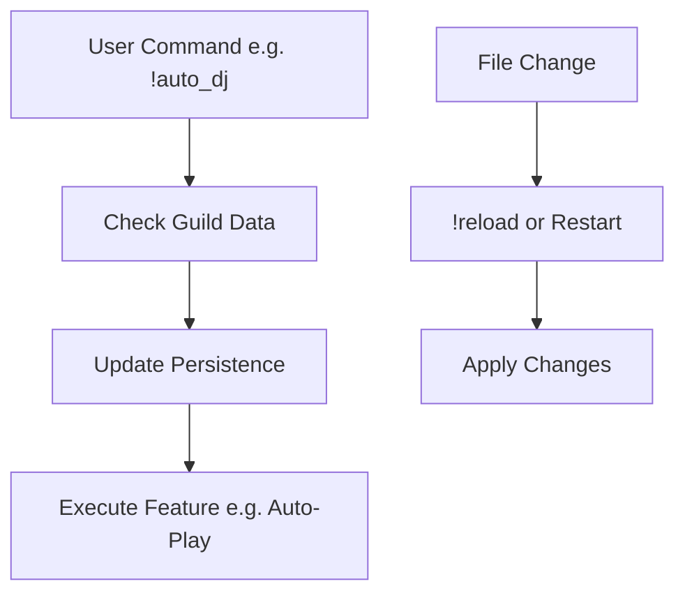

# Feature Additions for Discord Music Bot

## Project Assessment
The current bot is fully implemented with modular, persistent structure, tested tests, and functional for Discord music playback (YouTube/SoundCloud), queue management, shuffle, volume control, and Suno user song scraping. Basic features like !shuffle for queue randomization are included. For a friend group, consider additional collaborative personalized features below for enhanced social listening.

## 1. Auto-DJ Mode
**Scope**: Toggle to auto-play from default playlist when queue empty.
**Implementation Details**: Add !auto_dj toggle command in music.py (store per guild in persistence). In play_next, if queue empty and auto on, extend queue with default playlist songs, play next. Update todo for code mode.

## 2. Personal Favorites
**Scope**: User-specific playlists for favorites.
**Implementation Details**: Extend persistence.py to store user_favorites as dict[user_id: deque[songs]]. Add !favorites_add <url>, !favorites_load commands in music.py (use yt_extractor). Load/save per user in guild data.

## 3. Skip Voting
**Scope**: Majority vote to skip song.
**Implementation Details**: Add guild_votes dict[song_id: set[voters]] in persistence. !vote_skip command adds voter; in after_playing, if votes >= guild_members / 2, skip. Clear votes after.

## 4. Volume Control
**Scope**: Adjust playback volume.
**Implementation Details**: IMPLEMENTED: Added !volume <0-200> in music.py (store per guild as self.volumes). In play_next, wrap source with discord.PCMVolumeTransformer(source, volume / 100). Applies to new songs; future enhancement for live volume change.

## 5. Selenium Scraper
**Scope**: Improve Suno scraping with JS support.
**Implementation Details**: IMPLEMENTED - Added Selenium and webdriver-manager to dependencies. In src/utils/scraper.py, use headless Chrome webdriver to load profile pages, wait for JS-rendered elements, extract song links via CSS selector 'a[href^="/song/"]'. Limits to 5 songs per profile. Fallback to BeautifulSoup if Selenium fails. Tested successfully on @huzzy profile.

## Workflow for Additions

These features make the bot more engaging for friends; implement in order.