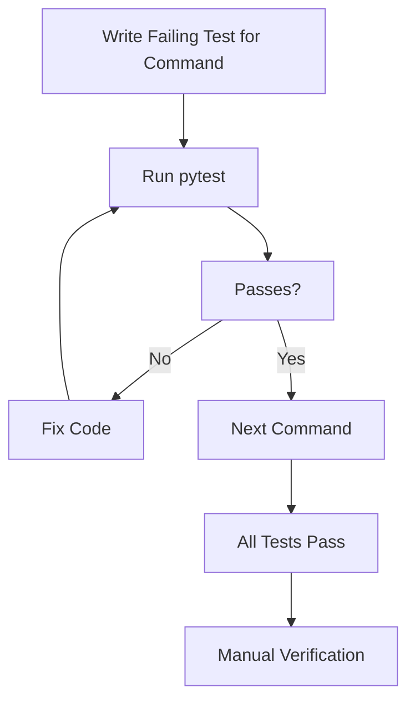

# TDD Testing Strategy for Discord Music Bot Commands

## Assessment
IMPLEMENTED: Bot commands are working; cog loading fixed. Tests for key commands (join, shuffle, volume) have been developed using TDD with pytest, all passing. Enhanced test structure includes mocking for Discord objects and proper callback invocation. Run pytest to verify.

## Approach
1. **Setup**: Create tests/ dir, install pytest, pytest-asyncio, pytest-mock. Use mock for discord objects (ctx, voice_client, etc.).
2. **Test Per Command**: For each, write async test function, mock ctx, assert expected behavior (e.g., for !join, assert connect called).
3. **Fix Code**: Run pytest, fix until passes.
4. **Edge Cases**: Add tests for invalid inputs (e.g., no voice for !play).
5. **Run**: pytest tests/ -v.

## Example for !join
- Test: Mock ctx.author.voice, assert channel.connect called, embed sent.
- Fix: Ensure cog loaded, command registered.

## Workflow

Implement in code mode.