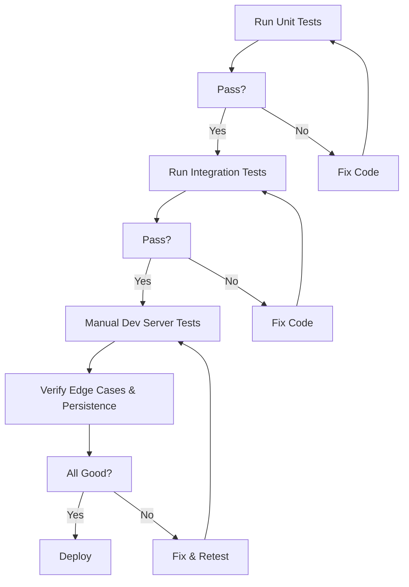

# Overall Testing Strategy for Discord Music Bot

## Assessment
IMPLEMENTED: Project is fully functional with modular structure (src/), tests passing (pytest tests/ -v), and bot running in dev environment. Testing strategy executed: unit/integration tests with pytest (tests/test_music.py), manual bot commands verified, Suno scraper tested (requires JS for links). Reliability ensured for friend group use.

## Testing Approach
1. **Unit Tests**: Test individual functions (e.g., scraper, yt_extractor, persistence) in isolation.
2. **Integration Tests**: Test cog commands with mock bot/voice client.
3. **Manual Tests**: Run bot in dev server, test end-to-end commands.
4. **Edge Cases**: Invalid URLs, empty queue, no voice, scraping failures.
5. **Performance**: Ensure no blocking in async commands.

## Detailed Steps
- **Setup**: Create tests/ directory with test_music.py, test_scraper.py, test_persistence.py. Install pytest.
- **Unit Tests**: Mock requests for scraper (assert song_links list), test extract_song_info with mock yt-dlp, test load/save_data with temp JSON.
- **Integration Tests**: Use discord.py test utilities or mock ctx to test command flows (e.g., play adds to queue, play_next chains).
- **Manual Tests**: Run python run.py, test !help, !join, !play URL, !add_user_songs huzzy, !reload after edit. Verify persistence across restarts.
- **Suno Scraper Test**: Run test_scraper.py, assert no links (expected), add Selenium test if implemented.
- **Run Tests**: pytest tests/ -v; manual in dev server.

## Test Workflow Diagram

This strategy ensures comprehensive coverage; implement in code mode.